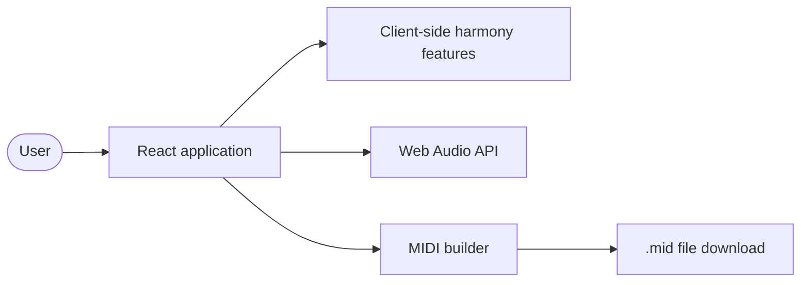

# MIDI Progression Editor - Architecture Guide

## Overview

**MIDI Progression Editor** is a standalone React/TypeScript parametric MIDI sequencer for exploring and editing chord progressions. Music theory calculations, audio playback, and MIDI generation run in the browser; the built frontend can be served as static files without a backend.

### Technology Stack

| Layer | Technology | Purpose |
|-------|-----------|---------|
| UI | React 19, TypeScript | Interactive sequencer |
| Build and development | Vite | Development server and static production build |
| Audio | Web Audio API | In-browser chord playback |
| MIDI | `@tonejs/midi` | Client-side MIDI file construction |
| Testing | Vitest | Frontend unit and integration tests |

## System Architecture



The app has no runtime API requests or server-side music logic. The Vite development server is only needed during development; production output is static content in `client/dist/`.

## Frontend Architecture

The frontend uses feature-based modules under `client/src/features/`. Features own their components, hooks, types, and utilities; shared UI and helpers live in `client/src/shared/`.

| Feature | Responsibility |
|---------|----------------|
| `audio` | In-browser chord audio playback |
| `chord` | Chord types, data, names, and utilities |
| `chord-animation`, `chord-geometry`, `chord-morphing` | Chord shape geometry and animation |
| `chromatic-circle` | Main 12-note SVG visualisation and interaction |
| `chord-inspection`, `chord-intervals`, `current-chord` | Chord and tone details |
| `color-language`, `legend` | Chord colors and visual legend |
| `harmonic-graph`, `ii-v-suggestions`, `voice-leading` | Harmony paths and progression suggestions |
| `midi-export` | MIDI file export |
| `progression-sidebar`, `progression-templates` | Progression editing |
| `scale` | Scale generation and diatonic highlighting for eight modes |
| `negative-harmony`, `tutorial` | Negative harmony and first-use guidance |

### Hardening Contracts

These contracts are canonical for geometry and custom-chord identity logic:

- Normalize note values to pitch classes in 0..11, deduplicate them, circularly order polygon notes, and root-rotate where root context exists.
- Resolve exact chord identity before applying deterministic fallback classification or display formatting.
- Keep pitch-class operations in `client/src/features/chord/utils/`, polygon ordering in `client/src/features/chromatic-circle/utils/`, and identity policy in `client/src/features/current-chord/utils/`.
- UI call sites should consume these utilities rather than reimplementing their logic.

## Development

### Prerequisites

- Node.js 18 or newer
- npm

### Start the app

```bash
cd client
npm install
npm run dev
```

The app is available at `http://localhost:5173`. From the repository root, `./run-dev.sh` (macOS/Linux) or `run-dev.bat` (Windows) installs dependencies when needed and starts Vite.

### Build, test, and lint

```bash
cd client
npm run build
npm test
npm run lint
```

`npm run build` type-checks the project and produces static files in `client/dist/`. The output can be deployed to any static web host.

## References

- [React documentation](https://react.dev)
- [Vite documentation](https://vite.dev)
- [Geometric Harmony System](docs/geometric-harmony-system.md)
