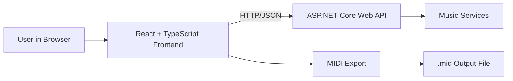
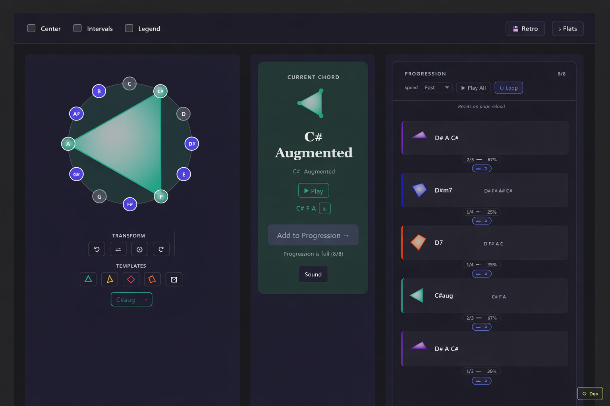

# Apeirograph — Parametric MIDI Sequencer

[](https://github.com/JWWade/midi-progression-editor/actions/workflows/ci.yml)

## About

**Apeirograph** is a parametric MIDI sequencer for exploring and editing chord progressions. It combines an interactive React/TypeScript web interface with an ASP.NET Core Web API backend, enabling musicians to:

- Visualize chord shapes on an interactive chromatic circle
- Build chord progressions with a dedicated sidebar (up to 8 chords, session-only)
- Explore triads and seventh chords across all root notes and qualities
- Animate smooth transitions between chord shapes
- Display scale degrees with 8 available modes
- Identify voice-leading paths between consecutive chords
- Inspect individual tones: note name, chord role, interval from root, and frequency
- Play back chords with in-browser audio and export progressions as standard MIDI files (`.mid`)

## Architecture Overview



## Prerequisites

- **Node.js** 18 or higher (for frontend)
- **.NET 10 SDK** (for backend)
- **npm** (comes with Node.js)

## Quick Start

### Option 1: Automated (macOS / Linux)

```bash
chmod +x run-dev.sh
./run-dev.sh
```

### Option 2: Automated (Windows)

```bat
run-dev.bat
```

Both launchers start the backend on http://localhost:5110 and the frontend on http://localhost:5173.

### Option 3: Manual Setup

**Terminal 1 — Backend**

```bash
cd server/ParametricMusic.Api
dotnet restore  # First time only
dotnet run
```

- API listens on: http://localhost:5110
- Swagger UI: http://localhost:5110/swagger
- Health check: GET http://localhost:5110/health

**Terminal 2 — Frontend**

```bash
cd client
cp .env.example .env.local  # First time only; edit if backend runs elsewhere
npm install                  # First time only
npm run dev
```

- App: http://localhost:5173

## UI Preview



The preview highlights the chromatic circle workspace, progression sidebar, and inspector panel.

## Environment Variables

Create `client/.env.local` to override defaults:

```bash
VITE_API_BASE_URL=http://localhost:5110
```

See [client/.env.example](client/.env.example) for all available variables.

## API Client Type Generation

After modifying backend endpoints, regenerate the TypeScript client (requires the backend running on port 5110):

```bash
cd client
npm run generate:api
```

This fetches the OpenAPI spec and regenerates `src/api/generated/index.ts`. **Never edit this file manually.**

Usage:
```typescript
import { client } from '@/api/client';

const result = await client.post('/Scale/from-root', {
  query: { note: 'C' },
  body: { scaleType: 'major' }
});
```

## Testing

### Backend

```bash
cd server/ParametricMusic.Tests
dotnet test
```

### Frontend

```bash
cd client
npm test
```

## Lint & Code Quality

```bash
cd client
npm run lint
```

ESLint enforces zero warnings. All TypeScript files must pass.

## Project Structure

The frontend follows a feature-based architecture with 21 modules under `client/src/features/`. The backend exposes REST endpoints via controllers in `server/ParametricMusic.Api/Controllers/`. See [ARCHITECTURE.md](ARCHITECTURE.md) for a full breakdown.

## Technologies

- **Frontend**: React 19, TypeScript ~6.0, Vite 8, ESLint 10
- **Backend**: ASP.NET Core .NET 10, Swashbuckle 10.1.7, xUnit 2.9
- **API**: OpenAPI/Swagger specification with code generation
- **Build**: npm + dotnet CLI

## Contributing

See [CONTRIBUTING.md](CONTRIBUTING.md) for setup instructions, code style guidelines, and the PR workflow.
