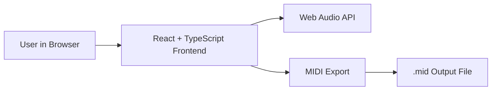
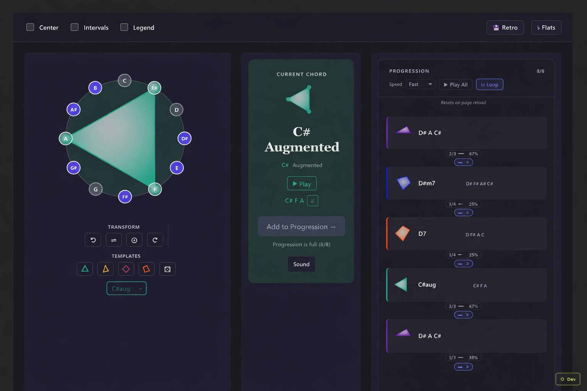

# Apeirograph — Parametric MIDI Sequencer

[](https://github.com/JWWade/midi-progression-editor/actions/workflows/ci.yml)

## About

**Apeirograph** is a standalone React/TypeScript parametric MIDI sequencer for exploring and editing chord progressions, enabling musicians to:

- Visualize chord shapes on an interactive chromatic circle
- Build chord progressions with a dedicated sidebar (up to 8 chords, session-only)
- Generate and audition 7 diatonic triads from the current key context directly under circle controls
- Explore triads and seventh chords across all root notes and qualities
- Animate smooth transitions between chord shapes
- Display scale degrees with 8 available modes
- Identify voice-leading paths between consecutive chords
- Inspect individual tones: note name, chord role, interval from root, and frequency
- Play back chords with in-browser audio and export progressions as standard MIDI files (`.mid`)

## Architecture Overview


```mermaid
flowchart LR
   U[User in Browser] --> F[React + TypeScript Frontend]
   F --> A[Web Audio API]
   F --> E[MIDI Export]
   E --> O[.mid Output File]
```

## Prerequisites

- **Node.js** 18 or higher (for frontend)
- **npm** (comes with Node.js)

## Quick Start

### Option 1: Automated (macOS / Linux)

```bash
chmod +x run-dev.sh
./run-dev.sh
```

### Option 2: Automated (Windows)

```bat
run-dev.bat
```

Both launchers install frontend dependencies when needed and start the app at http://localhost:5173.

### Option 3: Manual Setup

```bash
cd client
npm install                  # First time only
npm run dev
```

- App: http://localhost:5173

## UI Preview



The preview highlights the chromatic circle workspace, progression sidebar, and current chord panel.

## Testing

### Frontend

```bash
cd client
npm test
```

## Lint & Code Quality

```bash
cd client
npm run lint
```

ESLint enforces zero warnings. All TypeScript files must pass.

## Project Structure

The frontend follows a feature-based architecture with modules under `client/src/features/`. Music theory calculations, audio playback, and MIDI export run in the browser. See [ARCHITECTURE.md](ARCHITECTURE.md) for a full breakdown.

## Documentation

- [docs/README.md](docs/README.md) — documentation index (architecture, audits, spikes, and references)
- [ARCHITECTURE.md](ARCHITECTURE.md) — system architecture overview
- [CONTRIBUTING.md](CONTRIBUTING.md) — contribution workflow and coding standards

## Technologies

- **Frontend**: React 19, TypeScript 5.9.x, Vite 8, ESLint 10
- **Build**: npm

## Contributing

See [CONTRIBUTING.md](CONTRIBUTING.md) for setup instructions, code style guidelines, and the PR workflow.
