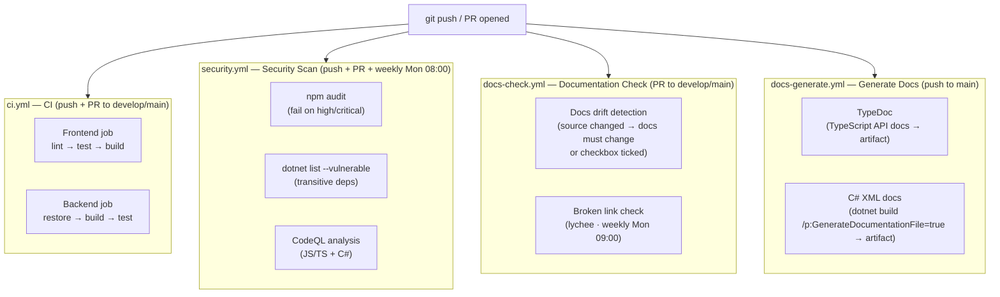

# CI/CD Pipeline

Overview of all GitHub Actions workflows that run automatically on push, pull-request, and schedule events.

## Workflow Summary

| Workflow | Trigger | Purpose |
|----------|---------|---------|
| `ci.yml` | Push/PR to `develop`, `main` | Lint, test, and build frontend and backend |
| `security.yml` | Push/PR to `develop`, `main`; weekly Mon 08:00 | Dependency vulnerability audit, CodeQL SAST |
| `docs-check.yml` | PR to `develop`, `main`; weekly Mon 09:00 (links only) | Detect docs drift; check for broken links |
| `docs-generate.yml` | Push to `main`; manual | Generate TypeDoc API docs and C# XML docs as build artifacts |
| `delete-merged-branches.yml` | PR close, push to `main` | Housekeeping: delete merged remote branches |

## Required Checks for Merge

Branch protection on `develop` and `main` should require:

- `Frontend (lint, test, build)` — from `ci.yml`
- `Backend (build, test)` — from `ci.yml`
- `Detect documentation drift` — from `docs-check.yml`
