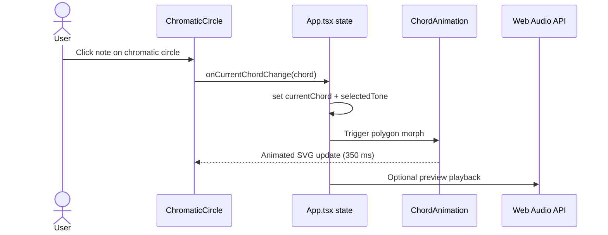
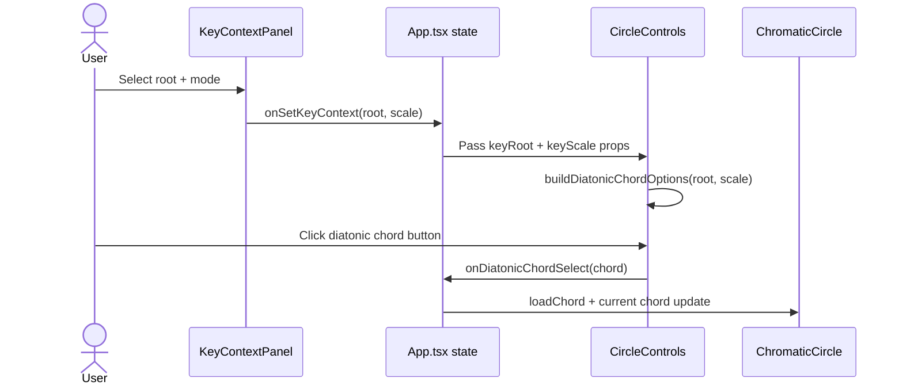
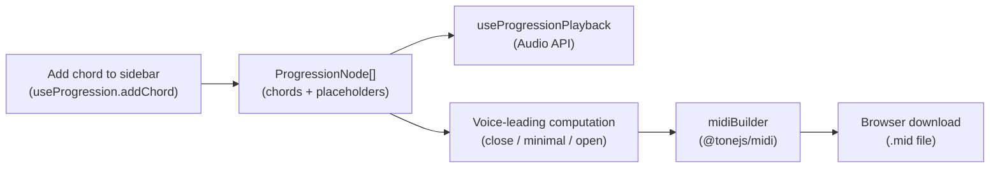
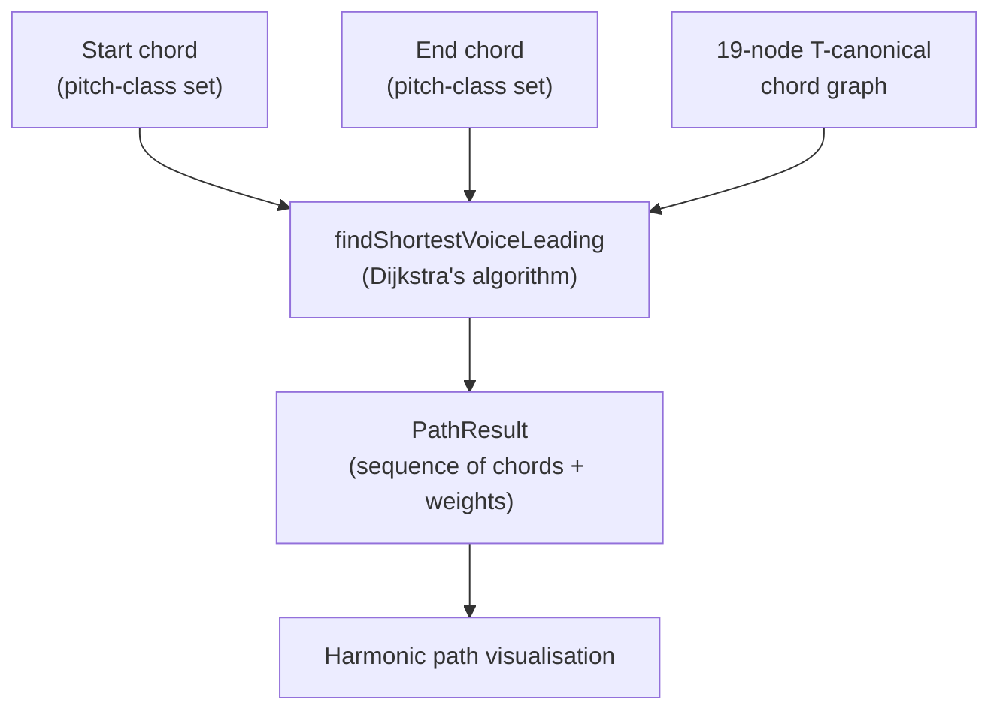

# Data Flow

End-to-end data flow from user interaction through to backend computation, audio playback, and MIDI file export.

## Chord Selection & Visualisation

## Key Context & Diatonic Row

## Chord Progression & MIDI Export

## Harmonic Graph Shortest Path

