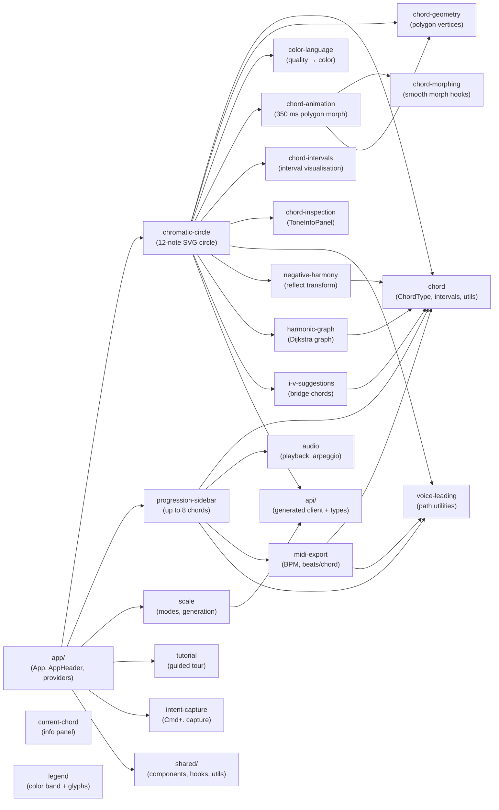

# Frontend Feature Modules

Dependency graph of the React/TypeScript feature modules under `client/src/features/`.
Arrows represent "depends on / imports from" relationships.

## Module Summary

| Module | Purpose |
|--------|---------|
| `audio` | In-browser chord and arpeggio playback via Web Audio API |
| `chord` | Core chord data, `ChordType` values, interval maps, utilities |
| `chord-animation` | Animated 350 ms `easeInOutQuad` polygon morphing |
| `chord-geometry` | Polygon vertex calculations (`CHORD_SHAPES`) |
| `chord-inspection` | Tone detail panel (`ToneInfoPanel`) |
| `chord-intervals` | Interval pattern visualisation |
| `chord-morphing` | Smooth polygon morphing hooks |
| `chromatic-circle` | Main 12-note SVG circle visualisation |
| `color-language` | Quality-based color system |
| `current-chord` | Current-chord info panel |
| `harmonic-graph` | Dijkstra shortest voice-leading path across all chords |
| `ii-v-suggestions` | ii–V bridge and tritone-substitution suggestions |
| `intent-capture` | Keyboard shortcut (Cmd/Ctrl+.) intent capture |
| `legend` | Color bands and polygon glyphs legend |
| `midi-export` | MIDI file export (BPM, beats/chord, voice-leading) |
| `negative-harmony` | Negative harmony pitch-class reflection |
| `progression-sidebar` | Chord progression sidebar (max 8 chords, session-only) |
| `scale` | Scale generation and display (8 modes) |
| `tutorial` | Guided in-app tutorial (tooltips, modals, action triggers) |
| `voice-leading` | Voice-leading path and voicing utilities |
