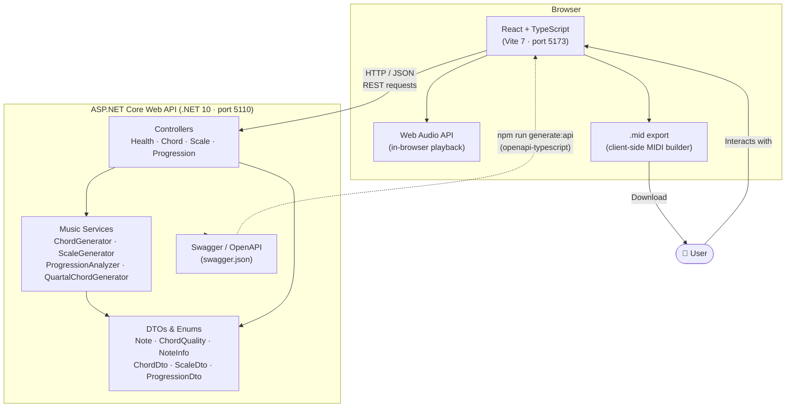

# System Overview

High-level topology of the Parametric MIDI Sequencer: how the browser, frontend application, backend API, and music services relate to each other.

## Component Responsibilities

| Component | Technology | Responsibility |
|-----------|-----------|----------------|
| React Frontend | React 19, TypeScript 5.9, Vite 7 | Interactive UI, chord visualisation, audio playback, MIDI export |
| ASP.NET Core API | .NET 10, C# | Music theory computation, scale/chord generation, progression analysis |
| Web Audio API | Browser built-in | In-browser chord and arpeggio playback |
| MIDI Builder | `@tonejs/midi` | Client-side MIDI file construction and download |
| OpenAPI / Swagger | Swashbuckle 10.1.4 | API contract definition; drives TypeScript client code generation |
