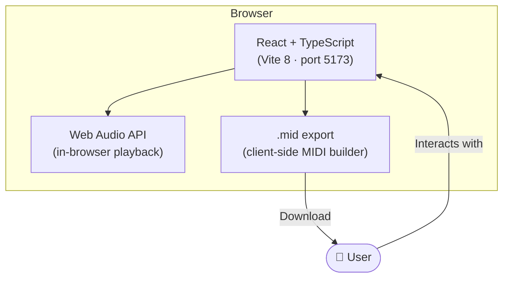

# System Overview

High-level topology of the standalone Parametric MIDI Sequencer: application logic and media generation run entirely in the browser.

```mermaid
flowchart TD
    subgraph Browser["Browser"]
        direction TB
        UI["React + TypeScript\n(Vite 8 · port 5173)"]
        AudioCtx["Web Audio API\n(in-browser playback)"]
        MIDIFile[".mid export\n(client-side MIDI builder)"]
    end

    User(["👤 User"]) -->|"Interacts with"| UI
    UI --> AudioCtx
    UI --> MIDIFile
    MIDIFile -->|"Download"| User
```

## Component Responsibilities

| Component | Technology | Responsibility |
|-----------|-----------|----------------|
| React Frontend | React 19, TypeScript 5.9, Vite 8 | Interactive UI, chord visualisation, audio playback, MIDI export |
| Web Audio API | Browser built-in | In-browser chord and arpeggio playback |
| MIDI Builder | `@tonejs/midi` | Client-side MIDI file construction and download |
